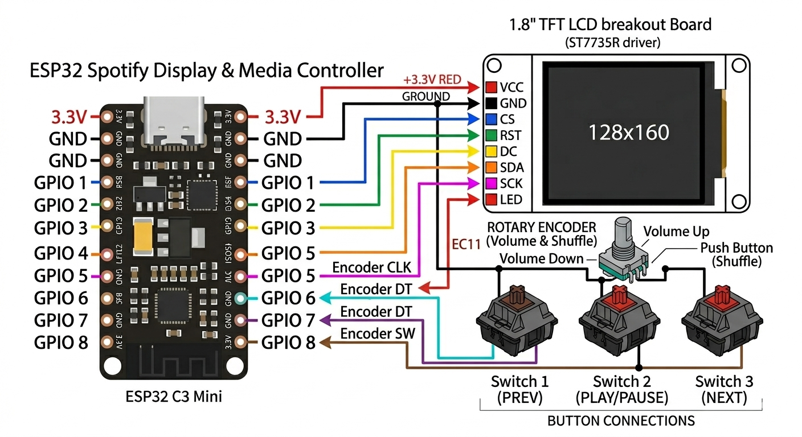

# BEAT VIEW SPOTIFY DISPLAY

My very own desktop Spotify display + controller powered by a C3 MINI ESP32 and a ST77XX TFT LCD screen it has 3 mechanical switches to let me control the music playback directly
from my desk without constantly switching windows in my computer.

## Why This Project Was Made

I made this to solve the annyoance of always having to switch tabs/windows and interrupting my work just to skip a song or pause it, so i was just randomly one day decided to look into the stasis starter projects and i seemed to love the idea to built something to fix it so i made it.

## Project Media

### 3D Model Render

### PCB Layout
*Everything is handwired and doesnt use a PCB*

### Wiring Diagram

#### Reference Pin Map:
* **TFT LCD VCC** -> ESP32 3.3V / 5V
* **TFT LCD GND** -> ESP32 GND
* **TFT LCD CS** -> ESP32 GPIO 1
* **TFT LCD RESET** -> ESP32 GPIO 2
* **TFT LCD DC** -> ESP32 GPIO 3
* **TFT LCD SDA (MOSI)** -> ESP32 GPIO 5
* **TFT LCD SCK (SCLK)** -> ESP32 GPIO 4
* **TFT LCD LED** -> ESP32 3.3V
* **Left Switch (Prev)** -> ESP32 GPIO 6 & GND
* **Middle Switch (Play/Pause)** -> ESP32 GPIO 7 & GND
* **Right Switch (Next)** -> ESP32 GPIO 8 & GND
* **Rotary Encoder CLK** -> ESP32 GPIO 0
* **Rotary Encoder DT** -> ESP32 GPIO 10
* **Rotary Encoder SW (Click)** -> ESP32 GPIO 20 & GND

---

#### Reference Pin Map:
* **TFT LCD VCC** -> ESP32 3.3V / 5V
* **TFT LCD GND** -> ESP32 GND
* **TFT LCD CS** -> ESP32 GPIO 1
* **TFT LCD RESET** -> ESP32 GPIO 2
* **TFT LCD DC** -> ESP32 GPIO 3
* **TFT LCD SDA (MOSI)** -> ESP32 GPIO 5
* **TFT LCD SCK (SCLK)** -> ESP32 GPIO 4
* **TFT LCD LED** -> ESP32 3.3V
* **Left Switch (Prev)** -> ESP32 GPIO 6 & GND
* **Middle Switch (Play/Pause)** -> ESP32 GPIO 7 & GND
* **Right Switch (Next)** -> ESP32 GPIO 8 & GND
* **Rotary Encoder CLK** -> ESP32 GPIO 0
* **Rotary Encoder DT** -> ESP32 GPIO 10
* **Rotary Encoder SW (Click)** -> ESP32 GPIO 20 & GND

---

## Bill of Materials (BOM)

| Name | Purpose | Qty | Total (USD) | Distributor |
| :--- | :--- | :---: | :---: | :--- |
| **Rotary Encoder Module** | FOR VOLUME CONTROL | 1 | $0.45 | ROBOCRAZE |
| **3D PRINTED CASE** | for 3d printing the case to actually put everything inside | 1 | $5.00 | Printing Legion! |
| **Breadboard Jumper Wires** | For connecting the pin headers of the ESP to the display and the key switches | 1 | $1.33 | ROBOCRAZE |
| **USB C data cable** | For connecting the display to my pc | 1 | $0.71 | Robocraze |
| **Keycaps** | For the keys for playing, pausing etc etc. | 1 | $1.04 | MECKEYS |
| **Key Switches** | For adding the play, pause functionality (HMX Xinhai 63.5g) | 1 | $3.38 | MECKEYS |
| **1.8 inch TFT LCD Module** | The Display for actually showing the now playing status | 1 | $2.92 | Robocraze |
| **ESP32-C3 Mini Development Board - Unsoldered** | Main board for actually making the display work by fetching the data from spotify and also controlling what the display shows. | 1 | $2.65 | Robocraze |

---

### Additional Costs Summary

* **Tax (USD):** $3.59
* **Shipping (USD):** $0.56
* **Grand Total (USD):** $21.63
