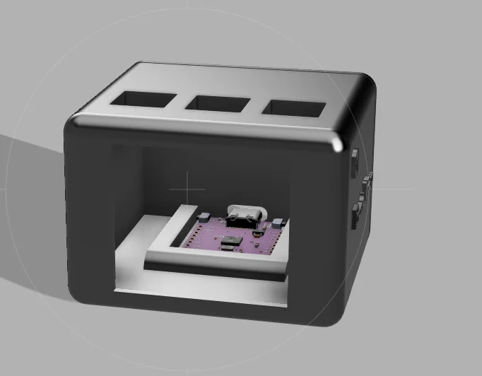
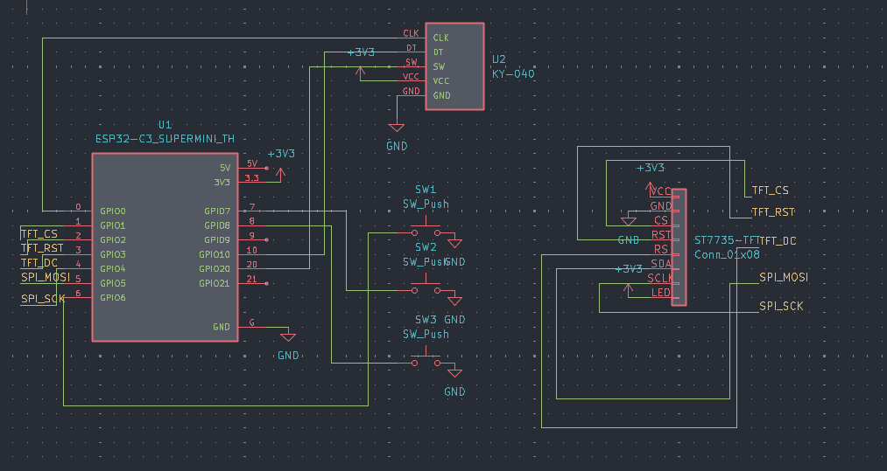

# BEAT VIEW SPOTIFY DISPLAY

My very own desktop Spotify display + controller powered by a C3 MINI ESP32 and a ST77XX TFT LCD screen it has 3 mechanical switches to let me control the music playback directly
from my desk without constantly switching windows in my computer.

## Why This Project Was Made

I made this to solve the annyoance of always having to switch tabs/windows and interrupting my work just to skip a song or pause it, so i was just randomly one day decided to look into the stasis starter projects and i seemed to love the idea to built something to fix it so i made it.

## Project Media

### 3D Model Render

### PCB Layout
*Everything is handwired and doesnt use a PCB*

### Wiring Diagram

#### Reference Pin Map

| Physical Component | Component Pin Label | Wire to ESP32-C3 Mini Pin |
| --- | --- | --- |
| **1.8" TFT (ST7735R)** | **VCC** | **`3.3V`** |
|  | **GND** | **`GND`** |
|  | **CS** | **`2`** |
|  | **RESET / RST** | **`1`** |
|  | **DC / RS** | **`3`** |
|  | **SDA / MOSI** | **`6`** |
|  | **SCL / SCK** | **`4`** |
|  | **LED / BL** | **`3.3V`** |
| **HMX Xinhai Switches** | **Prev Switch Pin 1** | **`5`** | 
| *(Orientation doesn't* | **Play Switch Pin 1** | **`7`** | 
| *matter for switches)* | **Next Switch Pin 1** | **`TX` (GPIO 21)** | 
|  | **ALL Switch Pin 2s** | **`GND`** | 
| **Rotary Encoder** | **CLK (or A)** | **`0`** | 
|  | **DT (or B)** | **`10`** |  |
|  | **SW (Button Pin 1)** | **`RX` (GPIO 20)** | 
|  | **GND & Button Pin 2** | **`GND`** | 

---

## Bill of Materials (BOM)

| Name | Purpose | Qty | Total (USD) | Distributor | Link |
| :--- | :--- | :---: | :---: | :--- | :--- |
| **Rotary encoder module** | For volume control | 1 | $0.45 | Robocraze | https://robocraze.com/products/rotary-encoder-module?variant=40193048543385 |
| **Breadboard jumper wires** | For connecting the pin headers of the esp to the display and the key switches | 1 | $1.33 | Robocraze | [https://robocraze.com](https://robocraze.com/products/jumper-wire-set-m2m-m2f-f2f-40-pcs-each?variant=40192573636761) |
| **USB C data cable** | For connecting the display to my pc | 1 | $0.71 | Robocraze | [https://robocraze.com](https://robocraze.com/products/type-c-usb-cable-1-metre?variant=40193636303001) |
| **Keycaps** | For the keys for playing, pausing etc etc. | 1 | $1.04 | Meckeys | [https://meckeys.com](https://meckeys.com/shop/accessories/keyboard-accessories/keycaps/blank-dsa-keycaps-1u/?attribute_pa_variations=red) |
| **Key switches** | For adding the play, pause functionality (HMX Xinhai 63.5g) | 1 | $3.38 | Meckeys | [https://meckeys.com](https://meckeys.com/shop/accessories/keyboard-accessories/keycaps/blank-dsa-keycaps-1u/?attribute_pa_variations=red) |
| **1.8 inch TFT LCD module** | The display for actually showing the now playing status | 1 | $2.92 | Robocraze | [https://robocraze.com](https://robocraze.com/products/1-8-inch-tft-lcd-module) |
| **ESP32-C3 mini development board - unsoldered** | Main board for actually making the display work by fetching the data from spotify and also controlling what the display shows. | 1 | $2.65 | Robocraze | https://robocraze.com/products/esp32-c3-mini-development-board-unsoldered?variant=48465411506400 |
| **Sandpaper** | For sanding and smoothing the case for better adhesion. | 1 | $0 | Amazon | - |

---

### Additional Costs Summary

* **Tax (USD):** $1.37
* **Shipping (USD):** $1.56
* **Grand Total (USD):** $16.04
